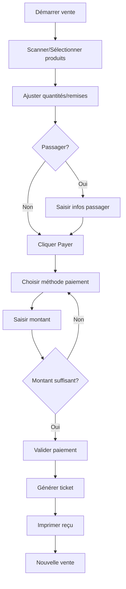

# Documentation - Page Caisse (POS)

## Vue d'ensemble

La page caisse (Point of Sale) est **déjà créée et fonctionnelle** dans l'application Duty Free. Elle permet de gérer les ventes, scanner les produits, calculer les totaux et traiter les paiements.

## 📍 Accès

- **URL** : `/dashboard/pos`
- **Route fichier** : `app/(dashboard)/dashboard/pos/page.tsx`
- **Menu** : Accessible via la sidebar → "Point de Vente" (icône panier)
- **Permission requise** : `pos.view`

## 🧩 Composants

### 1. Page principale (`page.tsx`)
**Emplacement** : `app/(dashboard)/dashboard/pos/page.tsx`

**Rôle** :
- Charge les données initiales (produits, catégories, devises, méthodes de paiement)
- Gère l'état de chargement
- Passe les données au composant `POSInterface`

**Données chargées** :
- ✅ Produits actifs et en stock
- ✅ Catégories
- ✅ Devises disponibles
- ✅ Méthodes de paiement

### 2. Interface POS (`POSInterface`)
**Emplacement** : `components/pos/pos-interface.tsx`

**Fonctionnalités** :
- Grille de produits avec recherche et filtres
- Gestion du panier
- Sélection de devise
- Informations passager
- Modal de paiement
- Intégration avec les menus/formules
- Gestion de session de caisse

**États gérés** :
- Panier (articles, quantités, prix, remises)
- Recherche de produits
- Catégorie sélectionnée
- Mode d'affichage (grille/liste)
- Informations passager
- Devise active
- Session de caisse courante

### 3. Grille de produits (`ProductGrid`)
**Emplacement** : `components/pos/product-grid.tsx`

**Fonctionnalités** :
- Affichage des produits en grille ou liste
- Recherche par nom, code-barres, SKU
- Filtrage par catégorie
- Ajout au panier au clic

### 4. Panier (`Cart`)
**Emplacement** : `components/pos/cart.tsx`

**Fonctionnalités** :
- Affichage des articles du panier
- Modification des quantités
- Application de remises
- Calcul des totaux (HT, TVA, TTC)
- Suppression d'articles
- Bouton de paiement

### 5. Modal de paiement (`PaymentModal`)
**Emplacement** : `components/pos/payment-modal.tsx`

**Fonctionnalités** :
- Sélection de la méthode de paiement
- Choix de la devise
- Saisie du montant
- Calcul de la monnaie à rendre
- Paiements multiples (split payment)
- Génération du ticket de caisse
- Impression du reçu

### 6. Informations passager (`PassengerInfoModal`)
**Emplacement** : `components/pos/passenger-info-modal.tsx`

**Fonctionnalités** :
- Saisie des informations de vol
- Numéro de carte d'embarquement
- Destination
- Compagnie aérienne
- Validation des données

## 🔑 Fonctionnalités principales

### Gestion de session
- Vérification de session de caisse active
- Chargement de la session courante de l'utilisateur
- Affichage d'avertissement si pas de session active

### Recherche et filtrage
- Recherche en temps réel par :
  - Nom du produit
  - Code-barres
  - SKU
- Filtrage par catégorie
- Affichage uniquement des produits actifs et en stock

### Gestion du panier
```typescript
interface CartItem {
  id: string
  product: any
  quantity: number
  unit_price: number
  discount_percent: number
}
```

### Calculs automatiques
- Sous-total
- Remises (pourcentage ou montant fixe)
- TVA
- Total TTC
- Conversion de devises
- Monnaie à rendre

### Multi-devises
- Sélection de la devise de vente
- Conversion automatique vers XOF (devise de base)
- Affichage des taux de change
- Support des paiements en plusieurs devises

### Méthodes de paiement
- Espèces
- Carte bancaire (avec 4 derniers chiffres)
- Mobile Money (avec numéro)
- TPE (avec référence)
- Paiements mixtes possibles

## 📱 Interface utilisateur

### Layout
```
┌─────────────────────────────────────────────────┐
│  Barre de recherche + Filtres catégories       │
├──────────────────────┬──────────────────────────┤
│                      │                          │
│   Grille produits    │      Panier              │
│   (zone principale)  │   (sidebar droite)       │
│                      │                          │
│                      │   - Articles             │
│                      │   - Totaux               │
│                      │   - Bouton paiement      │
└──────────────────────┴──────────────────────────┘
```

### Modals
1. **Modal Passager** : Informations de vol (optionnel)
2. **Modal Paiement** : Traitement du paiement et génération du ticket

## 🔄 Flux de vente



## 🛠️ APIs utilisées

### Produits
- `GET /api/products?is_active=true&in_stock=true`
- `GET /api/categories`

### Paiements
- `GET /api/payments/methods`
- `GET /api/currencies`
- `POST /api/sales` - Créer une vente
- `POST /api/payments` - Enregistrer un paiement

### Session
- `GET /api/cash-sessions/current?user_id={id}`
- `GET /api/settings/company`
- `GET /api/menus?is_active=true`

## 📊 Données persistées

Lors d'une vente, les données suivantes sont enregistrées :

### Table `sales`
- ticket_number
- seller_id
- cash_session_id
- point_of_sale_id
- customer_name (si passager)
- flight_reference
- airline
- destination
- total_ht
- total_ttc
- tax_amount
- discount_amount
- currency_code
- status

### Table `sale_lines`
- sale_id
- product_id
- quantity
- unit_price_ht
- unit_price_ttc
- discount_rate
- discount_amount
- tax_rate
- tax_amount
- total_ht
- total_ttc

### Table `payments`
- sale_id
- payment_method_id
- amount
- currency_code
- exchange_rate
- amount_in_base_currency
- card_last_digits (si carte)
- mobile_number (si mobile money)
- transaction_reference
- status

## 🎨 Design

### Thème
- Design moderne avec gradients
- Mode sombre/clair supporté
- Composants shadcn/ui
- Icônes Lucide React

### Responsive
- ✅ Desktop (layout 2 colonnes)
- ⚠️ Tablette (optimisé pour usage en caisse)
- ❌ Mobile (non prioritaire pour POS)

## 🔐 Sécurité & Permissions

### Permissions requises
- `pos.view` : Accès à la page
- Session de caisse active recommandée
- Utilisateur authentifié obligatoire

### Validations
- Vérification stock avant ajout au panier
- Validation des montants (pas de négatifs)
- Vérification session de caisse
- Validation des informations passager

## 🚀 Améliorations possibles

### Court terme
- [ ] Scanner code-barres avec caméra/lecteur
- [ ] Raccourcis clavier pour actions rapides
- [ ] Historique des dernières ventes
- [ ] Annulation de vente

### Moyen terme
- [ ] Mode hors ligne avec synchronisation
- [ ] Gestion des retours/remboursements
- [ ] Statistiques en temps réel du caissier
- [ ] Tiroir-caisse électronique

### Long terme
- [ ] Intégration TPE physique
- [ ] Reconnaissance faciale client fidèle
- [ ] IA pour suggestions de vente
- [ ] Analytics avancés

## 📝 Notes techniques

### Performance
- Filtrage côté client pour réactivité
- useMemo pour éviter recalculs inutiles
- Lazy loading des composants lourds

### État
- useState pour état local
- localStorage pour préférences
- Pas de Redux (pas nécessaire)

### Dépendances clés
- React 18+
- Next.js 14+
- shadcn/ui
- Lucide React
- Axios pour API calls

## 🐛 Debug

### Problèmes courants

**Produits ne s'affichent pas**
- Vérifier que les produits sont actifs (`is_active: true`)
- Vérifier le stock (`stock_quantity > 0`)
- Console : vérifier les erreurs de chargement

**Session de caisse manquante**
- L'utilisateur doit ouvrir une session via `/dashboard/cash-session`
- Vérifier `localStorage.getItem('user_data')`

**Paiement échoue**
- Vérifier les logs backend
- Vérifier que la session est active
- Vérifier les montants (pas de NaN)

### Logs utiles
```javascript
console.log('[POS] Products loaded:', products.length)
console.log('[POS] Current session:', currentSession)
console.log('[POS] Cart total:', cartTotal)
console.log('[POS] Payment data:', paymentData)
```

## ✅ Statut actuel

| Fonctionnalité | Statut |
|----------------|--------|
| Affichage produits | ✅ Fonctionnel |
| Recherche/Filtres | ✅ Fonctionnel |
| Gestion panier | ✅ Fonctionnel |
| Multi-devises | ✅ Fonctionnel |
| Paiements | ✅ Fonctionnel |
| Infos passager | ✅ Fonctionnel |
| Impression ticket | ✅ Fonctionnel |
| Session caisse | ✅ Fonctionnel |
| Scanner code-barres | ⚠️ À implémenter |
| Mode hors ligne | ⚠️ Partiel |

## 📞 Support

Pour toute question ou amélioration, consulter :
- Documentation API : `/BACKEND_ROUTES_DOCUMENTATION.md`
- Schéma BDD : `/scripts/001-create-schema.sql`
- Types TypeScript : `/lib/types/database.ts`

---

**Dernière mise à jour** : 21 décembre 2025
**Version** : 1.0
**Statut** : Production Ready ✅
